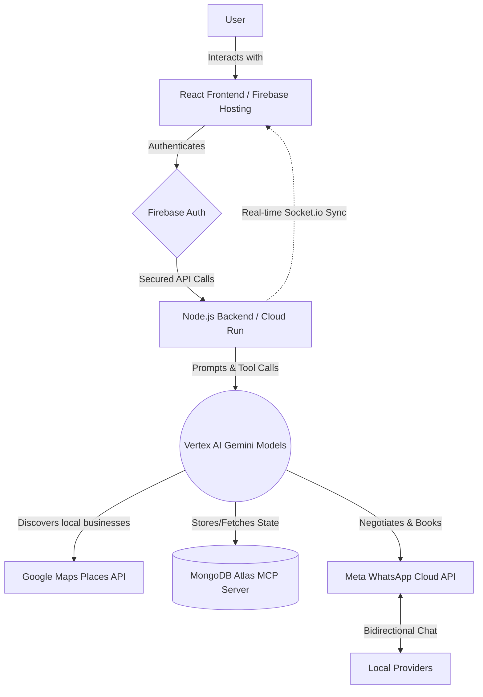

# RabbitaAI 🐇
### You type it. We handle it.

A global AI booking agent that handles any service request 
in natural language — finds real nearby providers via Google 
Maps and books them via WhatsApp autonomously.

**Live App:** https://rabbita-ai.web.app  
**Demo Video:** [ADD YOUTUBE LINK AFTER RECORDING]

## What It Does
Type anything you need in any language. RabbitaAI understands 
your request, finds the best nearby providers using real Google 
Maps data, contacts them via WhatsApp on your behalf, negotiates, 
and confirms the booking. You never make a call.

Works in Lagos, Karachi, Cairo, Jakarta, São Paulo — anywhere 
WhatsApp is used.

## Tech Stack
| Service | Purpose |
|---------|---------|
| Google Cloud Vertex AI (Gemini Models) | AI agent brain |
| MongoDB Atlas + MCP Server | Booking lifecycle + tool calls |
| Google Cloud Run | Backend hosting |
| Firebase Hosting + Auth | Frontend + authentication |
| Google Maps Places API (New) | Real nearby business discovery |
| Meta WhatsApp Cloud API | Autonomous provider messaging |
| Socket.io | Real-time booking feed |

## Architecture

## MongoDB MCP Integration
MongoDB Atlas MCP server manages complete booking lifecycle.
Gemini agent uses MCP tool calls to query conversation history,
update booking status, and retrieve user preferences — enabling
true agentic behavior without raw database queries.

## Key Features
- Natural language understanding in any language
- Real Google Maps business discovery with AI ranking
- Autonomous WhatsApp negotiation
- Race mode: contacts multiple providers simultaneously
- Human-in-the-loop for ambiguous situations
- Real-time booking feed via Socket.io
- Request ID routing for multi-user correctness

## Setup Instructions
1. Clone this repository
2. Copy backend/.env.example to backend/.env and fill values
3. Copy frontend/.env.example to frontend/.env and fill values
4. cd backend && npm install && node index.js
5. cd frontend && npm install && npm run dev

## Environment Variables Required
See backend/.env.example and frontend/.env.example

## Hackathon Track
Google Cloud Rapid Agent Hackathon — MongoDB Track
